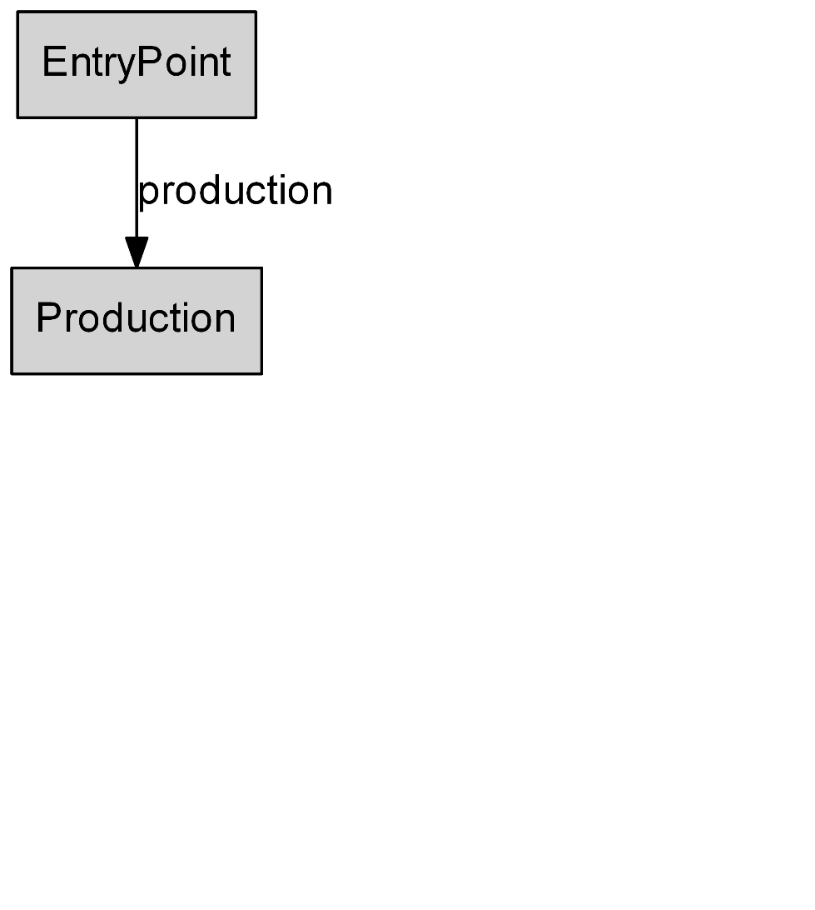

[HOME](../README.md)   [Part 1](../part1/part1.md)

# Part 2: Linking to another resource

Like you would on a web site REST advocates that resources are found and accessed by navigating, read following links, through the API. To do this the server provides prebuild links and relations to describe them. So for our RoboPlant we will add resources by adding links from resource to resource starting at the entry point. Instead of reading documentation and accessing a resource by building a URL a client would start getting the first route and follow a documented path of links until the desired resource is reached. So what is documented is no longer the URL but the names/relations of links to follow.
This way the server stays in control of his URLs and query strings (we see to that later) and can decide to change them or link you to another host.

## Adding the production link

Our RoboPlant needs some way to produce robots. We add a Link with relation `production` to the `EntryPointHto`.

```csharp
[HypermediaObject(Title = "Entry to the RoboPlant REST API", Classes = new[] { "EntryPoint" })]
public class EntryPointHto : HypermediaObject
{
    public EntryPointHto()
    {
        this.Links.Add("production", new HypermediaObjectKeyReference(typeof(ProductionHto)));
    }
}
```

Since we do not need any information of the `ProductionHto` to specify a link we can get away with just using a `HypermediaObjectKeyReference`. It tells the framework that it should build a link which will lead to a resource of type `ProductionHto`. So when the `EntryPointHto` is formatted the framework will look up if there is an attributed like `HttpGetHypermediaObject(typeof(ProductionHto))`.

At the moment there is not. If we request the entry point of our API: `http://localhost:5000/api/entrypoint` this will result in a message like:
`WebApi.HypermediaExtensions.Exceptions.RouteResolverException: Route to type 'ProductionHto' not found in RouteRegister.`

To ease development a little we can activate a framework option in `Startup.cs`:

```csharp
options.AddHypermediaExtensions(
    hypermediaOptions: new HypermediaExtensionsOptions
    {
        ReturnDefaultRouteForUnknownHto = true
    });
```

Now the formatter will generate a fake route for the relation `production`:

```json
{
    "class": [
        "EntryPoint"
    ],
    "title": "Entry to the RoboPlant REST API",
    "properties": {},
    "entities": [],
    "actions": [],
    "links": [
        {
            "rel": [
                "self"
            ],
            "href": "http://localhost:5000/api/entrypoint"
        },
        {
            "rel": [
                "production"
            ],
            "href": "http://localhost:5000/unknown/object/route"
        }
    ]
}
```

This is not for production code of course.

## Add the production HTO

To build a proper link we need to create a new controller and HTO for production.

```csharp
[Route("api/[controller]")]
[ApiController]
public class ProductionController : Controller
{
    public ProductionController(ProductionCommandHandler commandHandler)
    {
    }

    [HttpGetHypermediaObject(typeof(ProductionHto))]
    public async Task<ActionResult> GetProductionLines()
    {
        return Ok();
    }

}
```

If we request the `EntryPoint` again the framework is able to build a link:

```json
{
    "class": [
        "EntryPoint"
    ],
    "title": "Entry to the RoboPlant REST API",
    "properties": {},
    "entities": [],
    "actions": [],
    "links": [
        {
            "rel": [
                "self"
            ],
            "href": "http://localhost:5000/api/entrypoint"
        },
        {
            "rel": [
                "production"
            ],
            "href": "http://localhost:5000/api/production"
        }
    ]
}
```

That's it, we linked to another, single resource.

## How do I document my API

If the client only knows the entry point URL, how do we document the API? We need an alternative way. Commonly a documentation is a list of URLs with additional information like example JSONs, what HTTP method to use and maybe even when you are allowed to call that route. Doing so has several drawbacks:

- The clients are hardcoding the URLs and methods, so if the API needs to change it there will be a breaking change: all clients must determine which URLs or methods have changed and adapt.

- The clients need to figure out if it is allowed to use a certain URL (e.g. get a specific resource or create a new one). This is business logic and may also change over time. So this logic is part of the API. and if the API is not providing a specific link you are not allowed to use it (the API should respond with a error code 401 or 403).

### API map

One way to resolve this issue is using API maps to communicate the topology of an API. basically this is a graph where the entry point is the initial state. A client then moves along the edges, which represent the relations. So if a specific resource is to be accessed the client must choose a path to walk. An API map is pretty useful to talk about, it helps to understand how the API is designed.

### The current RoboPlant API map

Our current API only features two resources `EntryPoint` and `Prodcution`. Note that we use the class of the resource as label, not the C# class name, because that's an internal concern. The edge is labeled with the relation `production` used in the origin class `EntryPoint`



[Part 3: Communicating Errors](../part3/part3.md)